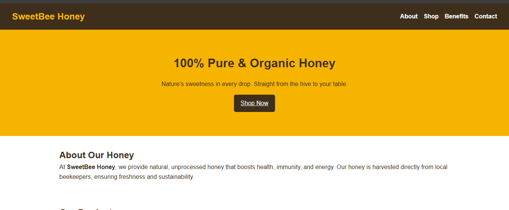
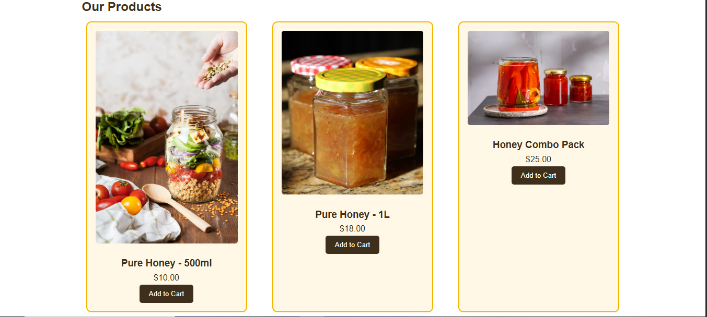

# Assignment Report – CSS Basics & The Box Model  

**Student:** Ojobor Jude Ikechukwu  
**Course:** Frontend Web Development  
**Assignment:** CSS Basics & The Box Model  
**Project Title:** Pure Honey E-Commerce Website  

---

## 📌 Overview  

This project demonstrates the foundational principles of **CSS** by building a simple yet professional **e-commerce website for a pure honey business**. The assignment showcases how the CSS **Box Model** influences layout, spacing, and dimensions, while maintaining **accessibility**, **readability**, and **SEO best practices**.  

---

## 🎯 Objectives Achieved  

| **Objective**             | **Implementation in Project** |
|----------------------------|-------------------------------|
| External CSS Linking       | Styles placed in `styles.css` and linked in `index.html`. |
| Basic CSS Properties       | Applied `color`, `font-size`, `margin`, `padding`, `border`, `background`. |
| Box Model Awareness        | Product cards, buttons, and form fields use `margin`, `padding`, and `border`. |
| Layout Structure           | Grid layout for product cards, flexbox for navigation. |
| Clean & Maintainable CSS   | Organized with comments, variables, and semantic class names. |
| Accessibility              | Added ARIA roles, focus states, labels, and keyboard navigation support. |
| SEO                        | Included meta description, keywords, and author tag in `<head>`. |

---

## 🖥️ Project Structure  

```plaintext
├── index.html              # Main HTML structure
├── styles.css              # External stylesheet
├── images                  # Image folder
└── ASSIGNMENT_REPORT.md    # Assignment documentation (this file)
```

## 🌐 Website Features  

- **Header & Navigation**  
  Accessible navigation bar with clear links (`About`, `Shop`, `Benefits`, `Contact`).  

- **Hero Section**  
  Eye-catching introduction with call-to-action button **Shop Now**.  

- **About Section**  
  Story about the honey business and its authenticity.  

- **Shop Section**  
  Product cards (500ml, 1L, Combo Pack) styled with the **CSS box model**.  

- **Benefits Section**  
  SEO-friendly bullet points on honey’s health advantages.  

- **Contact Section**  
  Accessible form with `label` and `input` for easy screen reader navigation.  

- **Footer**  
  Consistent branding with copyright.  

## 🎨 Design & Color Palette  

| **Element**        | **Color**               | **Purpose**                               |
|---------------------|-------------------------|-------------------------------------------|
| Primary Color       | `#f6b400` (Honey Gold)  | Highlights, hero background, branding      |
| Secondary Color     | `#3e2f1c` (Dark Brown) | Text, navbar, buttons, footer              |
| Background (Light)  | `#ffffff`              | Body background, readability               |

## 🧩 CSS Box Model in Action  

| **Component**   | **Box Model Properties Used** | **Effect**                                                             |
|------------------|-------------------------------|-------------------------------------------------------------------------|
| Product Cards    | `margin`, `padding`, `border` | Creates spacing between cards, inner padding, and visual boundary.      |
| Buttons          | `padding`, `border`           | Enlarges clickable area, adds outline.                                  |
| Form Fields      | `padding`, `margin`, `border` | Improves usability, separates fields.                                   |
| Navbar Links     | `padding`, `margin`           | Provides clickable space and spacing between links.                     |

## 📸 Screenshots    

  
  

## ✅ Conclusion  

This project fulfills all the assignment requirements by:  

- Using a **separate stylesheet**.  
- Demonstrating clear use of the **CSS box model**.  
- Building a **structured and visually appealing layout**.  
- Ensuring **accessibility** and **SEO best practices** are applied.  
